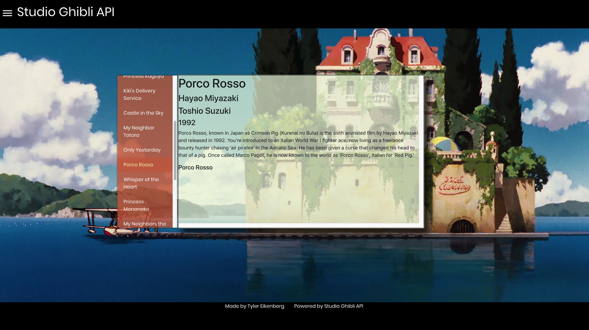
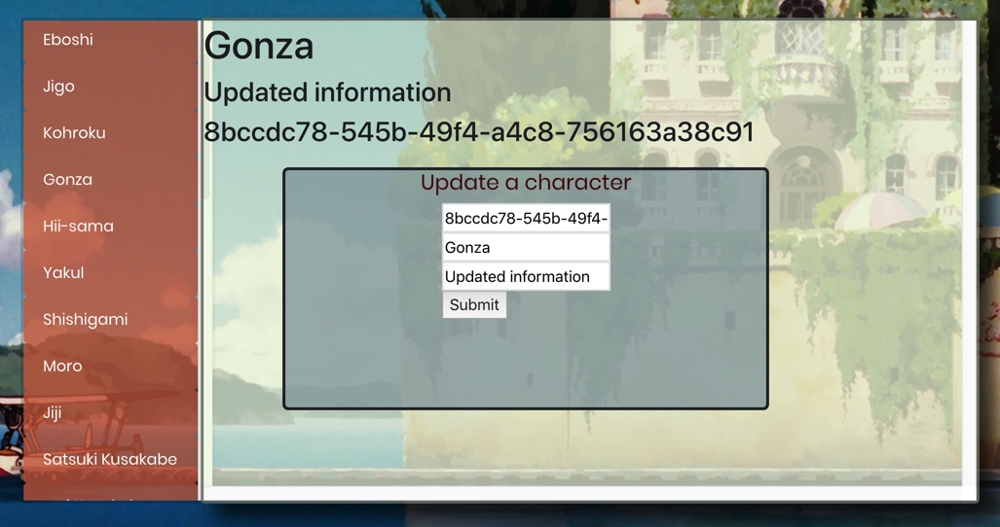

# Studio Ghibli Film Database

The Studio Ghibli Film Database is a website that utilizes my [Studio Ghibli API](https://ghibli-api-tse.herokuapp.com/) to display data about the various films that Studio Ghibli has produced. 


### URL: [Studio Ghibli Film Database](https://dazzling-meninsky-24845a.netlify.com/)




## Installation Instructions

1. clone this repository
```
git clone https://github.com/TylerEikenberg/Ghibli-FrontEnd
```
2. install dependencies
```
npm install
```
3. run the project
```
npm run start
```

### Features
The Studio Ghibli Film Database has full CRUD functionality. Using these features you can retrieve data from the database, as well as update character information, delete an existing character, or create your own character. 
  

  
    

*This project was bootstrapped with [Create React App](https://github.com/facebook/create-react-app).*  
*This project is a user interface for my [JSON API project](https://github.com/TylerEikenberg/Studio-Ghibli-Film-API).*  

